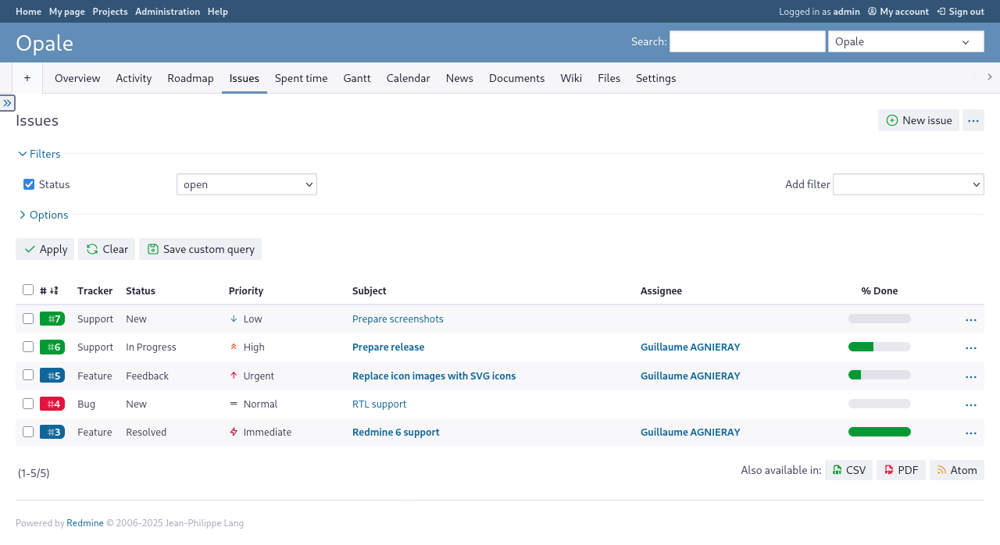

# Opale Redmine Theme

A Redmine 6.x theme.

---

## Main features

* Left sidebar,
* Colored trackers links,
* Jira-inspired priority icons,
* Customizable with SCSS.

## Releases

* **Redmine 6.x** : use either the latest stable release ([1.6.6](https://github.com/gagnieray/opale/archive/refs/tags/1.6.6.zip)), or use the `redmine-6.x` branch of this repository.
* **Redmine 5.x** : use either the latest stable release ([1.5.4](https://github.com/gagnieray/opale/archive/refs/tags/1.5.4.zip)), or use the `redmine-5.x` branch of this repository.

## Install

To install this theme :

1. [download the lastest stable release](https://github.com/gagnieray/opale/archive/refs/tags/1.6.6.zip) and decompress the archive to your Redmine's `themes` folder,
2. rename the folder `opale-1.6.6` to `opale`,
3. go to `Redmine > Administration > Settings > Display`, select `Opale` from the theme's list and save the settings.

## Customize

If you wish to customize this theme to your needs, it is recommended that you use [Custom Opale Redmine Theme Builder](https://github.com/gagnieray/custom-opale-builder).

You will be able to override the Sass variables defined in `src/sass/_variables.scss` with the `!default` flag, add a logo and/or a favicon, and eventually add any custom Sass style rules you want.

## Troubleshooting

**With Redmine 6.x, upon initial installation, it might occur that the theme appears to be broken because the assets were not loaded**.

This happens because the assets of the theme have not been precompiled properly by Redmine.

Usually simply restarting the server should fix that.

If not, run the command `bundle exec rake assets:precompile RAILS_ENV=production` before restarting the server.

If deploying to a sub-uri, set the relative URL root as follows: `bundle exec rake assets:precompile RAILS_ENV=production RAILS_RELATIVE_URL_ROOT=/sub-uri`.

If you still experience issues with missing assets in the browser, try removing the public/assets directory before re-running the precompile: `bundle exec rake assets:clobber RAILS_ENV=production`.

## About Redmine Backlogs plugin

This theme also features a new look for [Redmine Backlogs](https://github.com/maedadev/redmine_backlogs) plugin.

To install it, simply copy stylesheets from `opale/plugins/redmine_backlogs` and overwrite files in `{redmine}/plugins/redmine_backlogs/assets/stylesheets`.

Then restart Redmine.

## Contributing

[Bug reports](https://github.com/gagnieray/opale/issues) and [Pull requests](https://github.com/gagnieray/opale/pulls) are welcome.
Please [read more about contributing](CONTRIBUTING.md).

## Authors

[Read more about the authors](AUTHORS.md).

## Copying

_Opale Redmine Theme_ is licensed under the [GNU Affero General Public License v3.0 or later](https://www.gnu.org/licenses/agpl-3.0), the text of which can be found in [LICENSE](LICENSE).

Licensing of included components:

* Normalize.css : [MIT License](https://github.com/necolas/normalize.css/blob/master/LICENSE.md),
* Bootstrap Mixins : [MIT License](https://github.com/twbs/bootstrap/blob/main/LICENSE),
* Tabler Icons: [MIT License](https://github.com/tabler/tabler-icons/blob/main/LICENSE).

All unmodified files from these projects retain their original copyright and license notices: see the relevant individual source files in `src/sass/vendor/`
